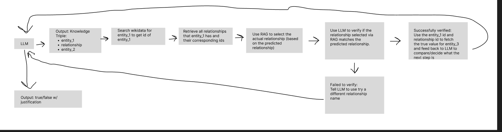

# Wikidata Agent
The main file in this directory is `fact_checker_agent.py`, which contains a class called `FactCheckerAgent`.

Here is a diagram of how the fact checker works:

Here is a written explanation of how a fact checking cycle might go:
1. Feed the LLM the prompt, for example, `Lebron James was born in the United States`
2. The LLM is prompted in a way that allows it to choose to either a) output a semantic triple to query wikidata b) respond to the user
3. First, the LLM will choose to output a semantic triple, since it has no prior information. Here is an example output: `{"entity_1": "Lebron James", "relationship": "birthplace", "entity_2": "United States"}`. Note, entity_2 is not actually used to query wikidata, but it is there so that the LLM has a framework for how to think. Rather, we will use `entity_1` and `relationship` to ask wikidata for the true value of `entity_2`, which the LLM will compare with the predicted (LLM generated) value for `entity_2`
4. Then, we will extract `entity_1` and `relationship` from the semantic triple, assuming that the output format was correct. If the output format was wrong, for example, if invalid JSON was generated, then we will ask the LLM to regenerate its output. Otherwise, we will extract `entity_1` and `relationship`.
5. With the value for `entity_1`, we will make an API call to the Wikidata Search API to find the ID of `entity_1`. Currently, the system chooses the very first value that appears from the wikidata search (though in the future, an optimization can be made to choose the most relevant, rather than the first, via LLM). If there are no search results returned, we will exit the loop and tell the user that the entity doesn't exist, and therefore the fact can not be verified.
6. Once we have the id for `entity_1`, we will fetch all the relationships that `entity_1` has via a SPARQL query to Wikidata.
7. All of these relationships and their IDs is added to a vector database. Then, we will query the vector database to find the closest match to the predicted/LLM generated `relationship` value. For example, the selected relationship would be `place of birth`
8. Then, the LLM will determine if the selected relationship, `place of birth`, matches the predicted relationship, `birthplace`. If it doesn't, then the LLM will try to generate a different relationship (go back to step 3). Otherwise, the loop will continue.
9. After verifying the relationship is correct, we will perform a SPARQL query to find the true value for `entity_2`, which will be fed to the LLM (step 3), and the LLM will determine whether to keep performing more SPARQL queries or not. In this case, we get `Akron` as the birthplace, so the LLM will keep going.
10. The LLM knows that Akron is not a country, so the LLM will generate another semantic triple: `{"entity_1": "Akron", "relationship": "country", "entity_2": "United States"}`
11. The process will repeat, and the LLM will then find out that Akron is apart of the US, so the LLM will then tell the user, `True. Lebron James was born in Akron, which is in the United States`